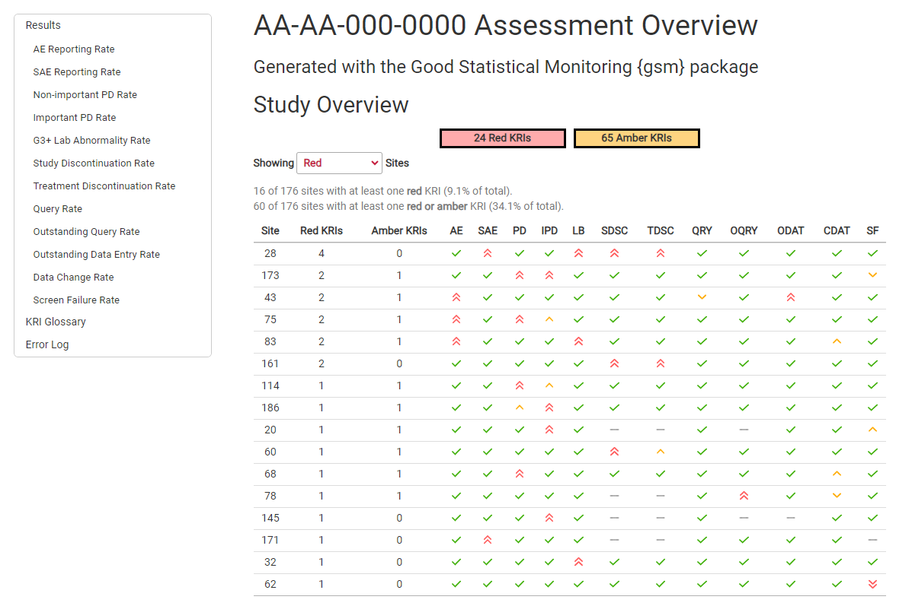
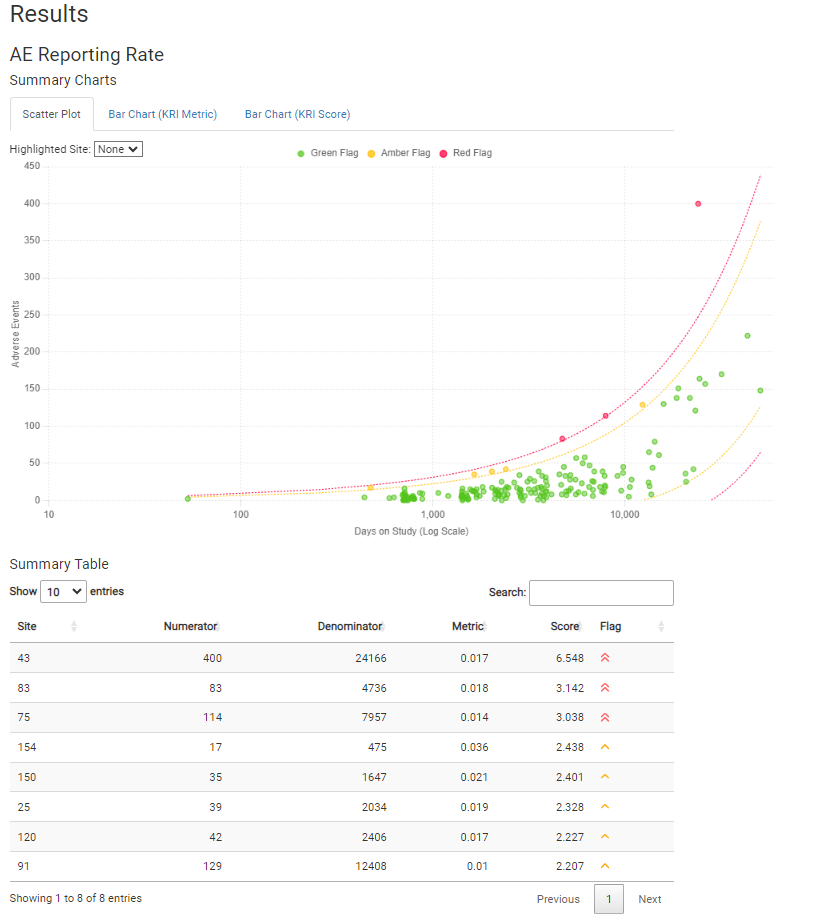

<!-- badges: start -->

 

<!-- badges: end -->

# Good Statistical Monitoring `{gsm.core}` R package

The `{gsm.core}` package provides the analytical foundation for a standardized Risk Based Quality Monitoring (RBQM) framework for clinical trials that pairs a flexible data pipeline with robust reports like the one shown below.  

 
 

This README provides a high-level overview of `{gsm.core}`; see the [package website](https://gilead-biostats.github.io/gsm.core/) for additional details.

The `{gsm.core}` package is a successor package to [`{gsm}`](https://github.com/Gilead-BioStats/gsm), which has been deprecated as of March 2025.
The contents of `{gsm}` have been split out among 4 packages as follows:

1. **`{gsm.core}`**: A package containing the analytics functionality and utility functions to run workflows.
2. [**`{gsm.mapping}`**](https://github.com/Gilead-BioStats/gsm.mapping): A package that provides workflows to apply the necessary data transformation from raw/source datasets to appropriate domains.
3. [**`{gsm.kri}`**](https://github.com/Gilead-BioStats/gsm.kri): A package that provides workflows
    to generate metrics and functionality to visualize and report on these metrics.
4. [**`{gsm.reporting}`**](https://github.com/Gilead-BioStats/gsm.reporting): A package that provides workflows
    to generate the reporting data model needed to generate reports.

# Background 

The `{gsm.core}` package lays the framework to perform risk assessments primarily focused on detecting differences in quality at the site-level. "High quality" is defined as the absence of errors that matter. We interpret this as focusing on detecting potential issues related to critical data or process across the major risk categories of safety, efficacy, disposition, treatment, and general quality, where each category consists of one or more risk assessment(s). Each risk assessment will analyze the data to flag sites with potential issues and provide a visualization to help the user understand the issue. Some relevant references are provided below. 

- Centralized Statistical Monitoring: [1](https://www.ncbi.nlm.nih.gov/pmc/articles/PMC7308734/), [2](https://pubmed.ncbi.nlm.nih.gov/38796099/)
- EMA/FDA Guidance on Risk Based Management: [1](https://www.fda.gov/media/121479/download), [2](https://www.fda.gov/media/116754/download), [3](https://www.fda.gov/media/157718/download), [4](https://www.ema.europa.eu/en/documents/scientific-guideline/reflection-paper-risk-based-quality-management-clinical-trials_en.pdf)
- Risk Based Quality Management: [1](https://www.lexjansen.com/phuse-us/2024/ar/PAP_AR04.pdf), [2](http://www.transceleratebiopharmainc.com/wp-content/uploads/2017/09/Risk-Based-Quality-Managment.pdf), [3](https://pubmed.ncbi.nlm.nih.gov/38722529/)
- Related tools: [1](https://cluepoints.com/)

# Process Overview

The `{gsm.core}` package is the foundation of a data pipeline for RBM using R. The package, along with `{gsm.mapping}`, `{gsm.kri}` and `{gsm.reporting}` provides a framework that allows users to **assess** and **visualize** site-level risk in clinical trial data. The packages currently provide assessments for the following domains:

1.  Adverse Event Reporting Rate
2.  Serious Adverse Event Reporting Rate
3.  Non-important Protocol Deviation Rate
4.  Important Protocol Deviation Rate
5.  Grade 3+ Lab Abnormality Rate
6.  Study Discontinuation Rate
7.  Treatment Discontinuation Rate
8.  Query Rate
9.  Outstanding Query Rate
10. Outstanding Data Entry Rate
11. Data Change Rate
12. Screen Failure Rate

All `{gsm.core}` assessments use a standardized 6 step data pipeline: 

1.  **Input_Rate** - Converts `raw` data to `input` data.
2.  **Transform** - Converts `input` data to `transformed` data.
3.  **Analyze** - Converts `transformed` data to `analyzed` data.
4.  **Threshold** - Uses `analyzed` data to create one or more numeric `thresholds`.
5.  **Flag** - Uses `analyzed` data and numeric `thresholds` to create `flagged` data.
6.  **Summarize** - Selects key columns from `flagged` data to create `summary` data.

To learn more about `{gsm.core}`'s data pipeline, visit the [Data Pipeline article](https://gilead-biostats.github.io/gsm.core/articles/DataModel.html).

# Reporting

Detailed RMarkdown/HTML reporting is built into `{gsm.core}`, and provides a detailed overview of all risk assessments for a given trial. For example, an AE risk assessment looks like this: 

 

Full reports for a sample trial run with [`{clindata}`](https://github.com/Gilead-BioStats/clindata) are provided below:

- [Site Report](https://gilead-biostats.github.io/gsm.core/report_kri_site.html)
- [Country Report](https://gilead-biostats.github.io/gsm.core/report_kri_country.html)

# Quality Control

Since {gsm.core} is designed for use in a [GCP](https://en.wikipedia.org/wiki/Good_clinical_practice) framework, we have conducted extensive quality control as part of our development process. In particular, we do the following:  

- **Qualification Workflow** - All assessments have been Qualified as described in the Qualification Workflow article. A Qualification Report article is generated and attached to each release. 
- **Unit Tests** - Unit tests are written for all core functions.
- **Workflow Tests** - Additional unit tests confirm that core workflows behave as expected.
- **Contributor Guidelines** - Detailed contributor guidelines including step-by-step processes for code development and releases are provided as a vignette.
- **Data Model** - Article providing detailed descriptions of the data model.
- **Code Examples** - The Cookbook article provides a series of simple examples, and all functions include examples as part of Roxygen documentation. 
- **Code Review** - Code review is conducted using GitHub Pull Requests (PRs), and a log of all PRs is included in the Qualification Report article.
- **Function Documentation** - Detailed documentation for each function is maintained with Roxygen.
- **Package Checks** - Standard package checks are run using GitHub Actions and must be passing before PRs are merged.
- **Data Specifications** - Machine-readable data specifications are maintained for all KRIs. Specifications are automatically added to relevant function documentation.
- **Continuous Integration** - Continuous integration is provided via GitHub Actions. 
- **Regression Testing** - Extensive QC and testing is done before each release. 
- **Code Formatting** - Code is formatted with {styler} before each release. 
 
Additional detail, including links to functional documentation and vignettes, is available in the [package website](https://gilead-biostats.github.io/gsm.core/).
